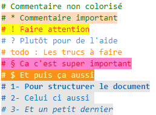

# Pack d'Extension SIN
Collection  d'extension pour travailler en SIN.

## Description
* Fournis les outils nécessaires pour développer correctement en **Python**. 
* Traduis VSCode en **Français**.
* Facilite le codage avec :
    * Indentation automatique, 
    * Extrait de code, 
    * Amélioration des commentaires (voir exemples ci-dessous),
    * Aperçu de l'exécution du python,
    * Quelques snippets.

## Les snippets pour pyqt  
* **Fen** : Ajoute le code permettant de lier une fenètre dessinée dans Qt Designer.
* **QtBout** : Ajoute le slot automatique pour un bouton.
* **QtSlid** : Ajoute le slot automatique pour un slider.

## Extensions dans ce pack
* [Better Comments](https://marketplace.visualstudio.com/items?itemName=aaron-bond.better-comments) - Améliorez vos commentaires de code en annotant avec des alertes, des informations, des tâches à faire et plus encore !

* [PYQT Integration](https://marketplace.visualstudio.com/items?itemName=zhoufeng.pyqt-integration)
* [Python](https://marketplace.visualstudio.com/items?itemName=ms-python.python) - IntelliSense (Pylance), Linting, Débogage (multithread, à distance), Jupyter Notebooks, formatage de code, refactorisation, tests unitaires, etc.
* [Python Preview](https://marketplace.visualstudio.com/items?itemName=dongli.python-preview) - Fournir un aperçu de l'exécution de Python.
* [Visual Studio IntelliCode](https://marketplace.visualstudio.com/items?itemName=VisualStudioExptTeam.vscodeintellicode) - Développement assisté par IA
* [French Language Pack for Visual Studio Code](https://marketplace.visualstudio.com/items?itemName=MS-CEINTL.vscode-language-pack-fr ) - Extension de pack de langue pour le français
* [Pylance](https://marketplace.visualstudio.com/items?itemName=ms-python.vscode-pylance) - Un serveur de langage performant et riche en fonctionnalités pour Python dans VS Code
* [Python Indent](https://marketplace.visualstudio.com/items?itemName=KevinRose.vsc-python-indent) - Corriger l'indentation Python.
* [Python Docstring Generator](https://marketplace.visualstudio.com/items?itemName=njpwerner.autodocstring) - Génération rapide de docstring avec """
* [Power Header](https://marketplace.visualstudio.com/items?itemName=epivision.vscode-file-header) - Ajout d'en-tête automatique avec ctrl+alt+h

