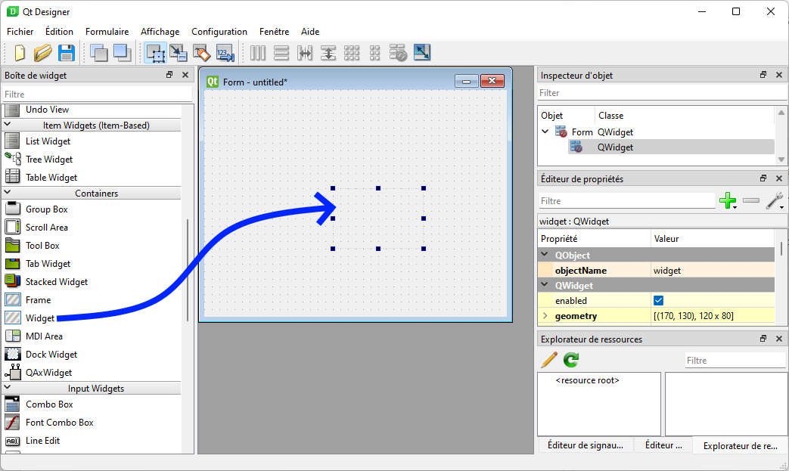
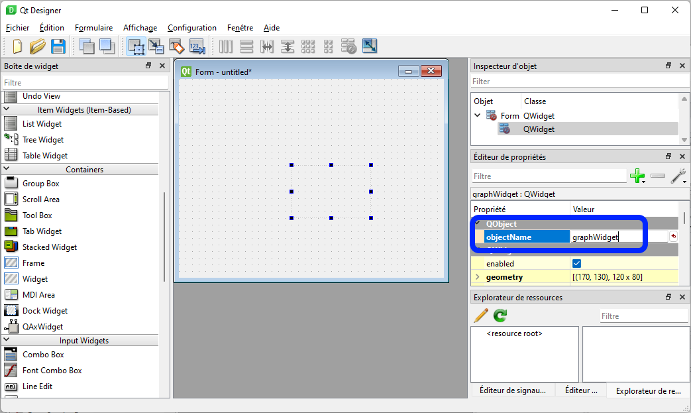
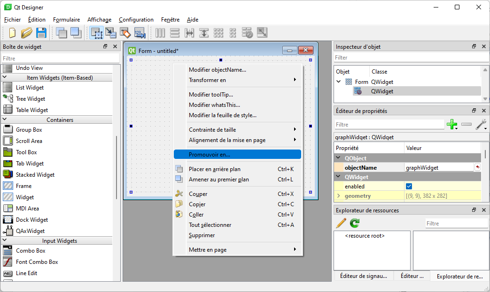
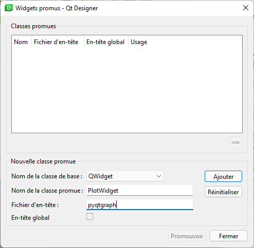

# Démarrage.
### Dans le terminale de VsCode :
## Mettre à jour pip :
> pip install --upgrade pip

## Vérifier que pyqtgraph est installé :
> pip list

## Installer Pyqtgraph : 
> pip install pyqtgraph

## Références :
> https://www.pyqtgraph.org/

> https://pyqtgraph.readthedocs.io/en/latest/

# Utiliser QtDesigner.
- Créer une fenêtre comme d'habitude.
- Insérer dedans un Widget vide.


- Donnez un nom au widget, « graphWidget » fera l'affaire. C'est juste pour référencer l'élément dans le code.


- Faites un clic droit sur le widget et sélectionnez Promouvoir en dans le menu contextuel du widget.


- Une boîte de dialogue apparait pour spécifier la classe de widget personnalisée que le widget d'espace réservé deviendra.
Faites la promotion du widget en spécifiant le nom de la classe en tant que PlotWidget et le fichier d'en-tête en tant que pyqtgraph.


- Cliquez sur ajouter puis promouvoir.

Voilà le graphe est en placez il reste à l'utiliser.
Enregistrez votre fenêtre puis fermez QtDesigner.

# De retour dans VsCode.
- Clic droit sur le fichier nomfichier.ui puis 
> Pyqt: Compile Form
- Créez le fichier de l'application par exemple MonApp.py et insérez un formulaire Qt avec le snippet QtForm.
- Insérez dedans les éléments pour modifier le graphe. Par exemple :

```python
from PyQt6.QtWidgets import QApplication, QWidget
from Ui_PyqtGraph import *
import pyqtgraph as pg  # Importer aprés Qt

class PyqtGraph(QWidget, Ui_Form):
    def __init__(self, parent=None):
        super().__init__(parent)
        self.setupUi(self)

        # Cette procédure est à compléter avec l’initialisation de votre fenêtre.
        hour = [1, 2, 3, 4, 5, 6, 7, 8, 9, 10]
        temperature_1 = [30, 32, 34, 32, 33, 31, 29, 32, 35, 45]
        temperature_2 = [50, 35, 44, 22, 38, 32, 27, 38, 32, 44]

        # Couleur du fond sur blanc
        self.graphWidget.setBackground("w")
        # Ajoute le titre
        self.graphWidget.setTitle("Mon titre", color="b", size="30pt")
        # Ajoute des labels sur l'axe x
        styles = {"color": "#f00", "font-size": "20px"}
        self.graphWidget.setLabel("left", "Température (°C)", **styles)
        self.graphWidget.setLabel("bottom", "Heure (H)", **styles)
        # Ajoute une légende
        self.graphWidget.addLegend()
        # Ajoute une grille
        self.graphWidget.showGrid(x=True, y=True)
        # Défini les plages sur x et y
        self.graphWidget.setXRange(0, 10, padding=0)
        self.graphWidget.setYRange(20, 55, padding=0)

        self.plot(hour, temperature_1, "Capteur 1", "r")
        self.plot(hour, temperature_2, "Capteur 2", "b")
        
    def plot(self, x, y, plotname, color):
       pen = pg.mkPen(color=color)
       self.graphWidget.plot(x, y, name=plotname, pen=pen, symbol="+", symbolSize=30, symbolBrush=(color))
   

app = QApplication ([])
window = PyqtGraph()
window.show ()
app.exec ()
```
- Ou encore :

```python
from PyQt6.QtWidgets import QApplication, QWidget
from random import randint
from Ui_PyqtGraph import *
import pyqtgraph as pg  # Importer aprés Qt

class PyqtGraph(QWidget, Ui_Form):
    def __init__(self, parent=None):
        super().__init__(parent)
        self.setupUi(self)

        # Cette procédure est à compléter avec l’initialisation de votre fenêtre.
        self.x = list(range(100))  # 100 points pour le temps
        self.y = [randint(0, 100) for _ in range(100)]  # 100 points pour les données

        self.graphWidget.setBackground("w")

        pen = pg.mkPen(color=(255, 0, 0))
        self.data_line = self.graphWidget.plot(self.x, self.y, pen=pen)

        self.timer = QtCore.QTimer()
        self.timer.setInterval(50)
        self.timer.timeout.connect(self.update_plot_data)
        self.timer.start()
        
    def update_plot_data(self):
        self.x = self.x[1:]  # Supprime le premier élément.
        self.x.append(self.x[-1] + 1)  # Ajoute uen nouvelle valeur 1 plus grande que la dernière.

        self.y = self.y[1:]  # Supprime le premier élément.
        self.y.append(randint(0, 100))  # Ajoute une nouvelle valeur aléatoire

        self.data_line.setData(self.x, self.y)  # Mets à jour les données.

app = QApplication ([])
window = PyqtGraph()
window.show ()
app.exec ()
```

