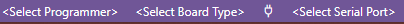
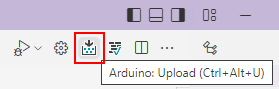
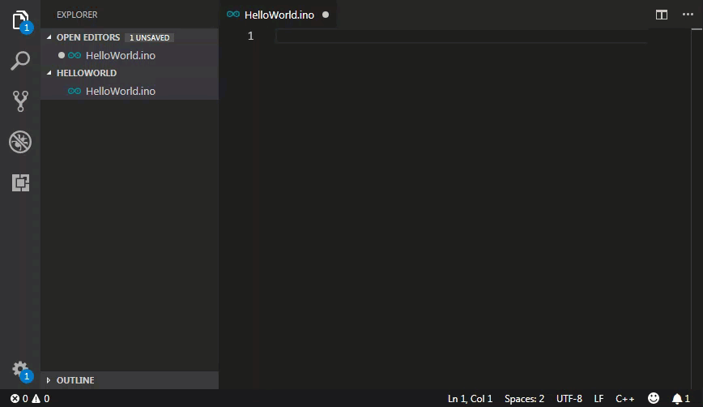
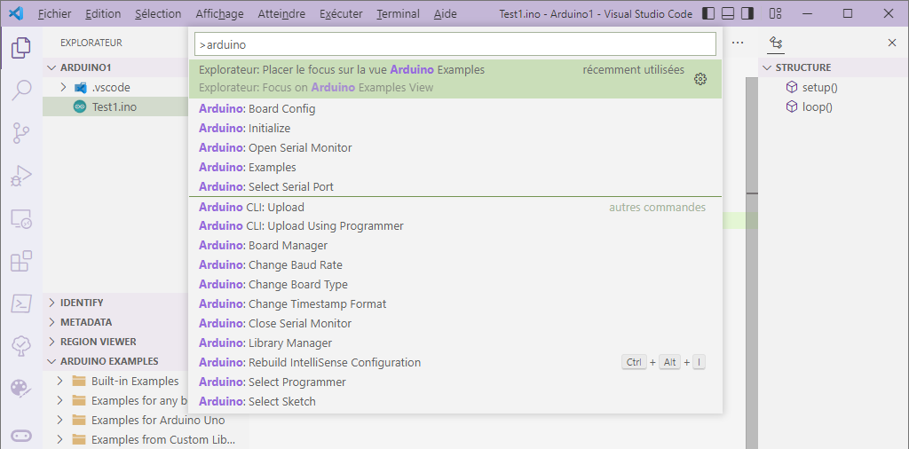

<!--
 _______       _            _     _          ______        _                 _ 
(_______)     (_)       _  (_)   | |        (____  \      (_)               | |
 _______  ____ _  ___ _| |_ _  __| |_____    ____)  ) ____ _ _____ ____   __| |
|  ___  |/ ___) |/___|_   _) |/ _  | ___ |  |  __  ( / ___) (____ |  _ \ / _  |
| |   | | |   | |___ | | |_| ( (_| | ____|  | |__)  ) |   | / ___ | | | ( (_| |
|_|   |_|_|   |_(___/   \__)_|\____|_____)  |______/|_|   |_\_____|_| |_|\____|
    
Auteur: Frank SAURET(frank.sauret.prof@gmail.com) 
arduino.md(Ɔ) 2022
Description : Tuto rapide pour les Arduino            
Créé le :  mercredi 6 juillet 2022, 18:11:27 
Dernière modification : jeudi 3 août 2023 à 19:02:03
-->

# Démarrage.
Dans la barre du bas :

1. Cliquez sur « Select Board Type » puis choisissez la carte Uno dans la liste.

2. Cliquez maintenant sur « Select Serial Port »  puis sélectionnez le port série correspondant à l’Arduino.

3. Cliquez sur « Select Programmer » puis sélectionnez « AVRISP mkII ».

# Compilation du code et téléversement.
 2 Boutons sont apparus :

Celui qui nous intéresse est le premier qui compile et envoie le programme dans la carte.
# Ouvrir le moniteur série

Cliquez sur la petite prise.
Vous pouvez aussi changer sa vitesse en cliquant sur la valeur.

Il est possible d’envoyer des commandes via le port Série. Dans la palette de commandes Arduino (Tapez F1 puis « arduino »), chercher « Send text to Serial Port ». Une barre de saisie apparait.

# Utiliser des bouts de code.
Pour programmer plus vite vous pouvez utiliser des bouts de code préparés pour vous :

La liste est ici :
> https://marketplace.visualstudio.com/items?itemName=ronaldosena.arduino-snippets

# Toutes les commandes
Comme pour toutes commandes dans vscode on peut les retrouver dans la palette de commande :
Tapez F1 puis « arduino ». La liste des commandes apparait.

