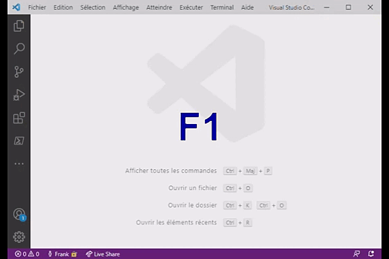

<!--
 _______       _            _     _          ______        _                 _ 
(_______)     (_)       _  (_)   | |        (____  \      (_)               | |
 _______  ____ _  ___ _| |_ _  __| |_____    ____)  ) ____ _ _____ ____   __| |
|  ___  |/ ___) |/___|_   _) |/ _  | ___ |  |  __  ( / ___) (____ |  _ \ / _  |
| |   | | |   | |___ | | |_| ( (_| | ____|  | |__)  ) |   | / ___ | | | ( (_| |
|_|   |_|_|   |_(___/   \__)_|\____|_____)  |______/|_|   |_\_____|_| |_|\____|
    
Auteur: Frank SAURET(frank.sauret.prof@gmail.com) 
configure.md(Ɔ) 2022
Description : Tuto de configuration de l'extension
Créé le :  vendredi 7 janvier 2022, 17:28:20 
Dernière modification : jeudi 3 août 2023 à 19:02:08
-->
# Configuration de l'extension.
La configuration se lance automatiquement. Elle devrait trouver toute seule votre nom, votre prénom et votre adresse mail mais elle vous proposera de les garder ou de les changer dans la barre de commande.

Vous pouvez la relancer avec la commande **F1** puis « **abriand-sin : configurer** ». 

Si la configuration a déjà été faite elle vous proposera par défaut les valeurs que vous avez déjà saisis.